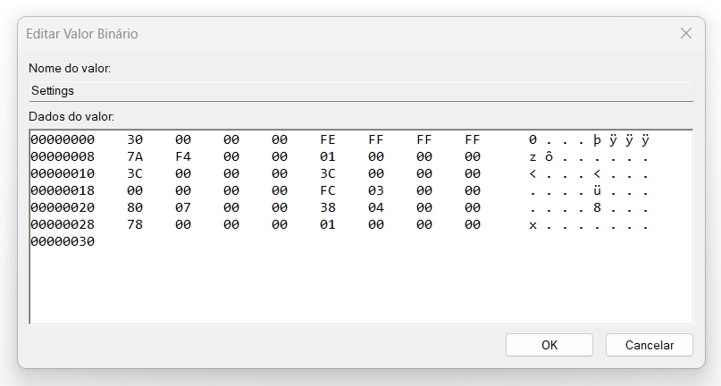

## Windows 10 
1) Win + R
- regedit
-> Computador\HKEY_CURRENT_USER\Software\Microsoft\Windows\CurrentVersion\Explorer\StuckRects3 
- Edit Settings
- Modify FE -> FE
         03 -> 01
 

## Windows 11 Versão 22H2 💻
NOT found