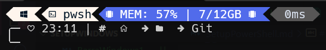
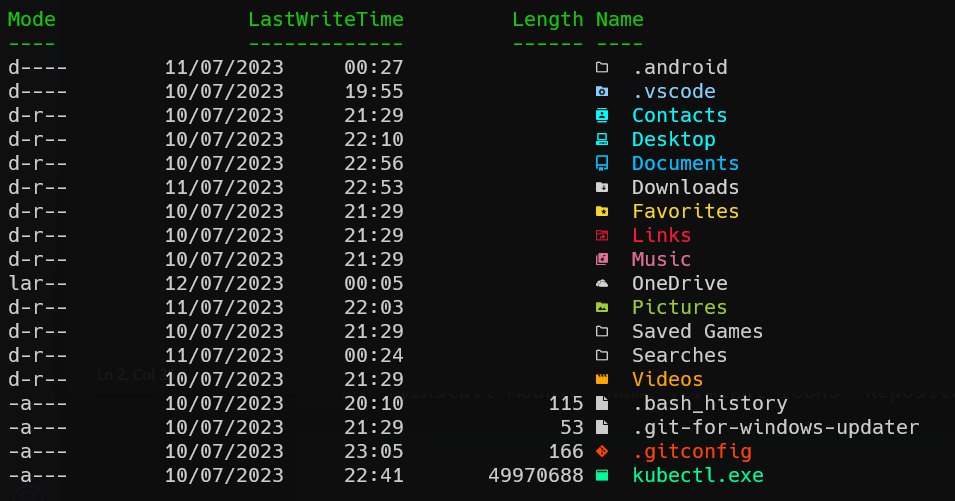

## Firecode
https://github.com/tonsky/FiraCode

## Mnm Windows -  Install Oh Myposh
https://ohmyposh.dev/docs/installation/windows

$winget install JanDeDobbeleer.OhMyPosh -s winget 

# Update
$winget upgrade JanDeDobbeleer.OhMyPosh -s winget

## Mnm Prompt
- INFO: When the above command gives an error, make sure to create the profile first.

$New-Item -Path $PROFILE -Type File -Force

Mode                 LastWriteTime         Length Name
----                 -------------         ------ ----
-a---          11/07/2023    22:42              0 Microsoft.PowerShell_profile.ps1

- Edit your PowerShell profile script, you can find its location under the $PROFILE variable in your preferred PowerShell version. For example, using notepad:
$notepad $PROFILE

* oh-my-posh init pwsh --config "$env:POSH_THEMES_PATH/clean-detailed.omp.json" | Invoke-Expression

## Mnm Fonts
https://www.nerdfonts.com

- Edit:
 "profiles": 
    {
        "defaults": {
            "fontFace": "Hack Nerd Font"
        },
    }

## Terminal-Icons
$Install-Module -Name Terminal-Icons -Repository PSGallery
Add  notepad $PROFILE:
Import-Module -Name Terminal-Icons
